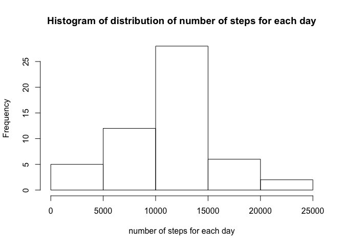
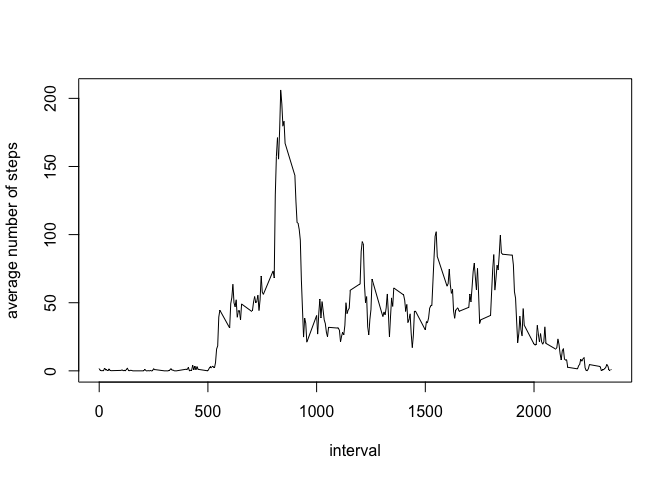
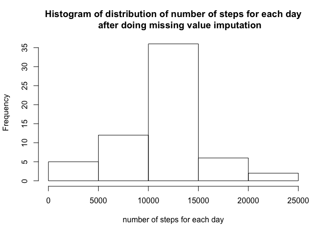
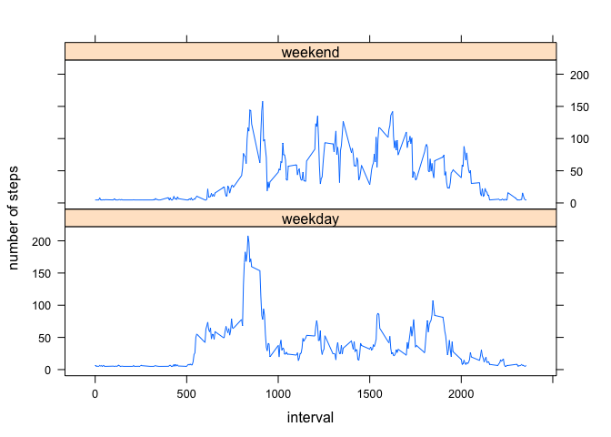

# Reproducible Research: Peer Assessment 1


## Loading and preprocessing the data

Unzip the data and load it into our workspace. *clean_data* stores all data rows which doesn't have NA.

```r
unzip("activity.zip") # unzip the data zip file
data <- read.csv(file = "activity.csv", header = TRUE, na.strings = "NA") # read the csv file
clean_data <- data[!is.na(data$steps), ] # ignore data rows with NA
```

## What is mean total number of steps taken per day?

1. Calculate the total number of steps taken per day


```r
library(dplyr) # use dplyr for processing data
```

```
## 
## Attaching package: 'dplyr'
```

```
## The following objects are masked from 'package:stats':
## 
##     filter, lag
```

```
## The following objects are masked from 'package:base':
## 
##     intersect, setdiff, setequal, union
```

```r
steps_by_date <- (clean_data %>%  
                  group_by(date) %>%        # group data by date
                  select(date, steps) %>%   # select only columns date and steps
                  summarise_each(funs(sum)))# summarize the total number of steps by each date
```

2. Make a histogram of the total number of steps taken each day


```r
hist(steps_by_date$steps, 
     main = "Histogram of distribution of number of steps for each day", 
     xlab = "number of steps for each day")
```



```r
dev.copy(png,'./figure/histogram_step_by_date.png') # save figure into file
```

```
## quartz_off_screen 
##                 3
```

```r
dev.off()
```

```
## quartz_off_screen 
##                 2
```

3. Calculate and report the mean and median of the total number of steps taken per day


```r
mean_step <- mean(steps_by_date$steps)
median_step <- median(steps_by_date$steps)
mean_step
```

```
## [1] 10766.19
```

```r
median_step
```

```
## [1] 10765
```

The mean and median of total number of steps taken per day are 1.0766189\times 10^{4} and 10765 respectively.

## What is the average daily activity pattern?

First, we group data rows by interval so that, and compute the average number of steps taken across all days for that interval


```r
steps_by_interval <- (clean_data %>%                  # from clean_date
                      group_by(interval) %>%          # group data by interval
                      select(interval, steps) %>%     # only keep 2 columns interval and steps
                      summarise_each(funs(mean)) %>%  # compute the mean of number of steps for each interval
                      arrange(interval))              # arrange the result in order of interval
```

1. Time series plot of the 5-minute interval (x-axis) and the average number of steps taken, averaged across all days (y-axis)


```r
plot(steps_by_interval$interval, steps_by_interval$steps, 
     type = "l", xlab = "interval", ylab = "average number of steps")
```



```r
dev.copy(png,'./figure/step_by_interval.png') # save figure into file
```

```
## quartz_off_screen 
##                 3
```

```r
dev.off()
```

```
## quartz_off_screen 
##                 2
```

2. Which 5-minute interval, on average across all the days in the dataset, contains the maximum number of steps?


```r
max_step <- max(steps_by_interval$steps)
max_step_interval <- steps_by_interval[steps_by_interval$steps == max_step, "interval"]
max_step_interval
```

```
## Source: local data frame [1 x 1]
## 
##   interval
##      (int)
## 1      835
```

```r
max_step
```

```
## [1] 206.1698
```

So 835 is the 5-minuteinterval which contains the maximum number of steps on average across all days in the dataset. And the average number of steps in this 5-minute interval is 206.1698113

## Imputing missing values

1. Calculate and report the total number of missing values in the dataset (i.e. the total number of rows with NAs)


```r
n_missing <- sum(is.na(data$steps))
n_missing
```

```
## [1] 2304
```

The total number of missing values in the dataset is 2304

2. Devise a strategy for filling in all of the missing values in the dataset. The strategy does not need to be sophisticated. For example, you could use the mean/median for that day, or the mean for that 5-minute interval, etc.

The strategy that we use in imputing missing value is to replace the missing values by dividing the number of interval in a day (12 * 24) by median total number of steps for each day.

3. Create a new dataset that is equal to the original dataset but with the missing data filled in.


```r
new_data <- data
new_data[is.na(new_data$steps), "steps"] <- median_step / (12 * 24)
```

4. Make a histogram of the total number of steps taken each day and Calculate and report the mean and median total number of steps taken per day. Do these values differ from the estimates from the first part of the assignment? What is the impact of imputing missing data on the estimates of the total daily number of steps?

First we compute the new total number of steps per day with filled-in missing values.


```r
new_steps_by_date <- (new_data %>% 
                    group_by(date) %>% 
                    select(date, steps) %>% 
                    summarise_each(funs(sum)))
```

The new histogram of the total number of stpes taken each day:


```r
hist(new_steps_by_date$steps, 
     main = "Histogram of distribution of number of steps for each day
     after doing missing value imputation", 
     xlab = "number of steps for each day")
```



```r
dev.copy(png,'./figure/step_by_date_after_filling_NA.png')
```

```
## quartz_off_screen 
##                 3
```

```r
dev.off()
```

```
## quartz_off_screen 
##                 2
```

Calculate the mean and median total number of steps taken per day after doing missing value imputation:


```r
new_mean_step <- mean(new_steps_by_date$steps)
new_median_step <- median(new_steps_by_date$steps)
new_mean_step
```

```
## [1] 10766.03
```

```r
new_median_step
```

```
## [1] 10765
```

The new mean and median of total number of steps taken per day afer filling in the missing values are 1.0766033\times 10^{4} and 1.0765\times 10^{4} respectively.

Notice that there is no much change in the results of mean and median because the missing values are filled by using the median number of steps.

## Are there differences in activity patterns between weekdays and weekends?

1. Create a new factor variable in the dataset with two levels – “weekday” and “weekend” indicating whether a given date is a weekday or weekend day.


```r
new_data$weekday <- factor(ifelse(weekdays(strptime(new_data$date, "%Y-%m-%d")) 
                                  %in% c("Monday", "Tuesday", "Wednesday", "Thursday", "Friday"),
                                  "weekday", "weekend"))
```

2. Make a panel plot containing a time series plot (i.e. type = "l") of the 5-minute interval (x-axis) and the average number of steps taken, averaged across all weekday days or weekend days (y-axis).

First we need to compute the new avager number of steps for each interval.


```r
new_steps_by_interval <- (new_data %>%
                          group_by(interval, weekday) %>%
                          select(interval, weekday, steps) %>%
                          summarise_each(funs(mean)) %>%
                          arrange(interval, weekday))
```

Then, we make a panel plot containing a time series plot (i.e. type = "l") of the 5-minute interval (x-axis) and the average number of steps taken, averaged across all weekday days or weekend days (y-axis).


```r
library(lattice)
xyplot(steps ~ interval | weekday, data = new_steps_by_interval, type = "l", 
       layout = c(1, 2), ylab = "number of steps")
```



```r
dev.copy(png,'./figure/weekday_vs_weekend.png') # save figure into file
```

```
## quartz_off_screen 
##                 3
```

```r
dev.off()
```

```
## quartz_off_screen 
##                 2
```
